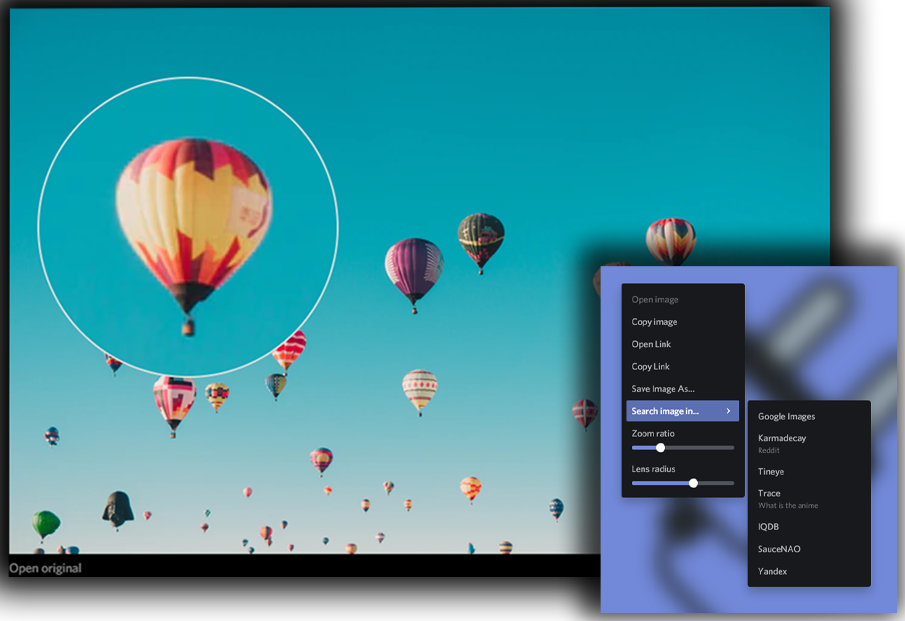

# Image Tools

Adds new features to images

## Features
- Lens in a modal image viewport
- Open image as modal in most context menus
- Copy image / link to image
- Save Image As
- Reverse image search
- Color capture

### Similar plugins
- [Image To Clipboard](https://github.com/Sidemen19/image-to-clipboard)
- [Reverse Image Search](https://github.com/lorencerri/powercord-reverse-image-search)
- [Copy Avatar URL](https://github.com/21Joakim/copy-avatar-url)
- [Image Utilities](https://github.com/mwittrien/BetterDiscordAddons/tree/master/Plugins/ImageUtilities) & [BetterImageViewer](https://github.com/1Lighty/BetterDiscordPlugins/tree/master/Plugins/BetterImageViewer) (BetterDiscord)
- [Avatar Links](https://github.com/joe27g/EnhancedDiscord/blob/master/plugins/avatar_links.js) (EnhancedDiscord)
